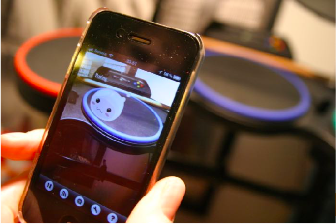
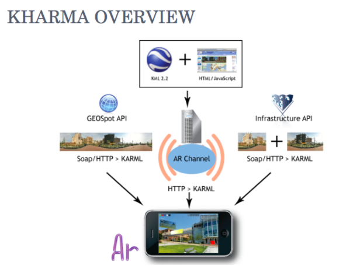
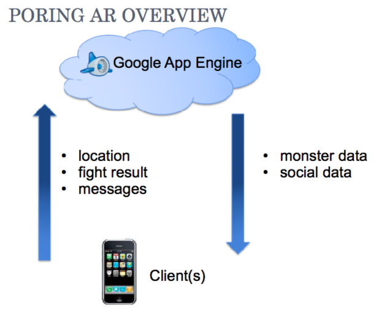

# PoringAR - Augmented Reality Mobile Game

Augmented reality game using Kharma-framework. Developed in 2010 on a university augmented reality course by Lauri & Joona.

*"Real world has invisible monsters lurking around us. They come alive when pointing them with the PoringAR app, and the fighting begins! Hunt Porings and collect Jellopies in true Ragnarok style in this Augmented Reality Mobile Massively Multiplayer Online Roleplaying Game (ARMMMORPG!)"*

## Demo

Video: [https://youtu.be/ppqytobeLqc](https://youtu.be/ppqytobeLqc)

## Technology

* Google App Engine - for backend
* KHARMA - an AR web browser for iPhone
* Code is python, JS, CSS & HTML

Our simple architecture consist of backend + client.

## Other

Course's presentation with more details can be found in docs:
[PoringAR_esitys.pdf](doc/PoringAR_esitys.pdf)

